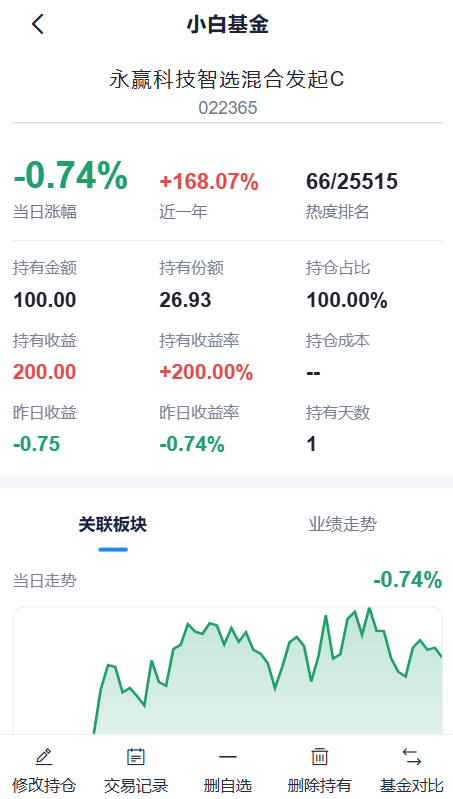
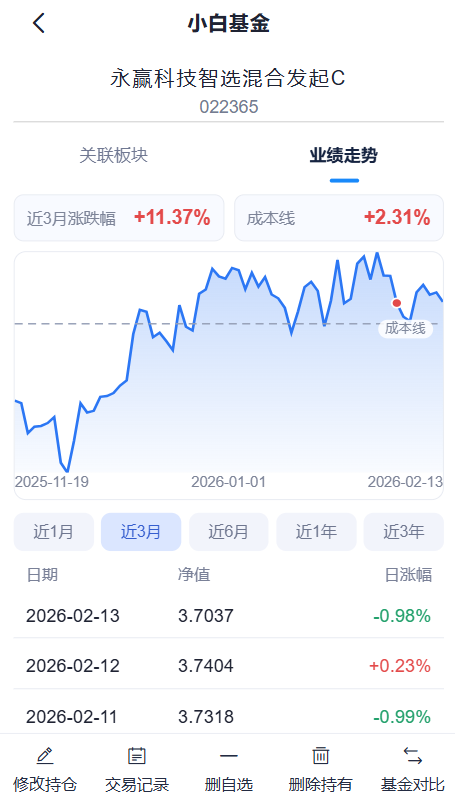
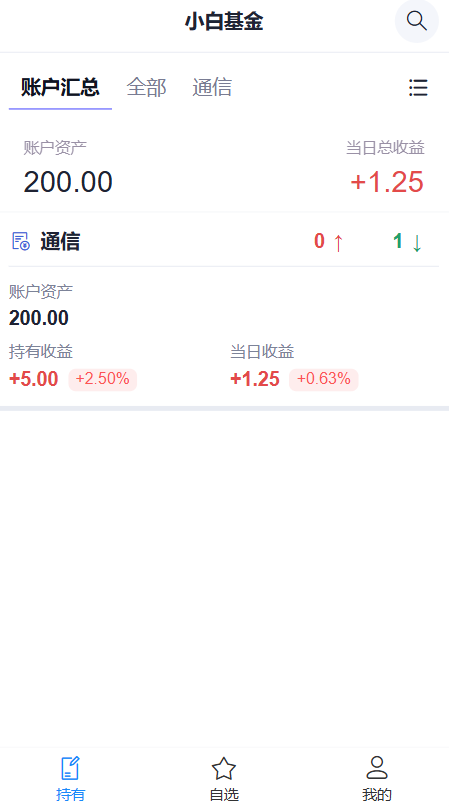

# 小白基金

一款功能丰富的开源基金管理工具，专为 Android 平台打造。

## 效果预览





## 快速开始


### 本地开发

```bash
# 克隆项目
git clone https://github.com/xiriovo/fund-app.git
cd fund-app

# 安装依赖
npm install

# 启动开发服务器
npm run dev

# 构建生产版本
npm run build
```

### Android APK 构建

```bash
# 构建 Web 并同步到 Android
npm run build
npx cap sync

# 命令行构建 Release 版本（需要 JDK 21）
cd android
./gradlew assembleRelease
```

APK 输出位置：
- Debug: `android/app/build/outputs/apk/debug/app-debug.apk`
- Release: `android/app/build/outputs/apk/release/app-release.apk`

## 技术栈

- **前端框架**：Vue 3 + TypeScript
- **构建工具**：Vite 7
- **UI 组件**：Vant 4 + Varlet 3
- **状态管理**：Pinia
- **图表绘制**：Canvas API
- **移动打包**：Capacitor 7
- **路由管理**：Vue Router 4


## 免责声明

⚠️ **重要提示**

- 本工具仅供学习交流使用，不构成任何投资建议
- 基金估值数据仅供参考，以基金公司公布的净值为准
- 数据刷新有延迟，仅供学习和参考
- **投资有风险，理财需谨慎**
- 下载后请在 24 小时内删除

## 开源协议

本项目基于 [MIT License](./LICENSE) 开源。

## 贡献指南

欢迎提交 Issue 和 Pull Request！

1. Fork 本仓库
2. 创建特性分支 (`git checkout -b feature/amazing-feature`)
3. 提交更改 (`git commit -m 'Add amazing feature'`)
4. 推送到分支 (`git push origin feature/amazing-feature`)
5. 创建 Pull Request


## 致谢

感谢所有为本项目做出贡献的开发者！
